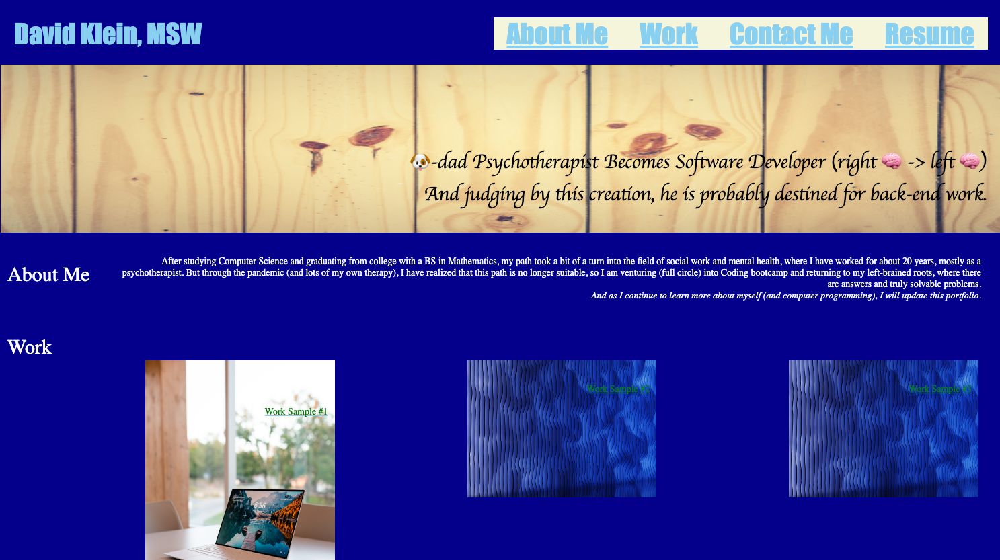

# challenge-2
Portfolio Challenge

## Welcome to my embodiment of Growth Mindset
The assignment being, to create the structure for what will become my professional portfolio. CSS did not come as intuitively to me as say, JavaScript has (for now) and the language itself got quite confusing, in particular around flex boxes and grids, and boxes within grids. I found myself lost in what "chain of command" was taking place, and as a result changing things around, experimenting, became even more challenging.

As a result, I thought it would be wiser of me to submit this, which I don't think is incomplete in any regard, and receive feedback, which I can then either implement or if I still have difficulties I can bring into tutoring next weekend.

The HTML is more commented (with questions, mainly) because it was a little easier for me to see where each element was contained, which, if this makes sense, it is very hard for me to follow what attaches to what, for some reason, and for example, therefore what should get flexed and what shouldn't.

## Motivation
Because of my background, I think it is important to show you my completed work in one place. I hope that as I continue to develop, that my interests and skills are displayed on this page.

## Portfolio URL

## Preview Screenshot
